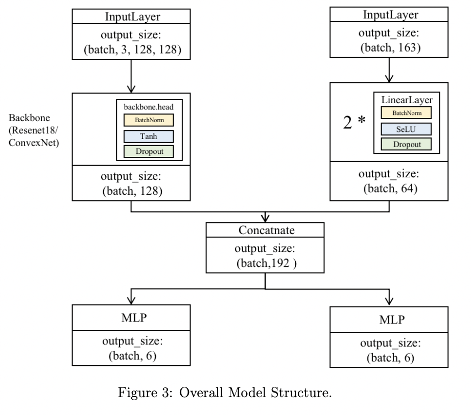
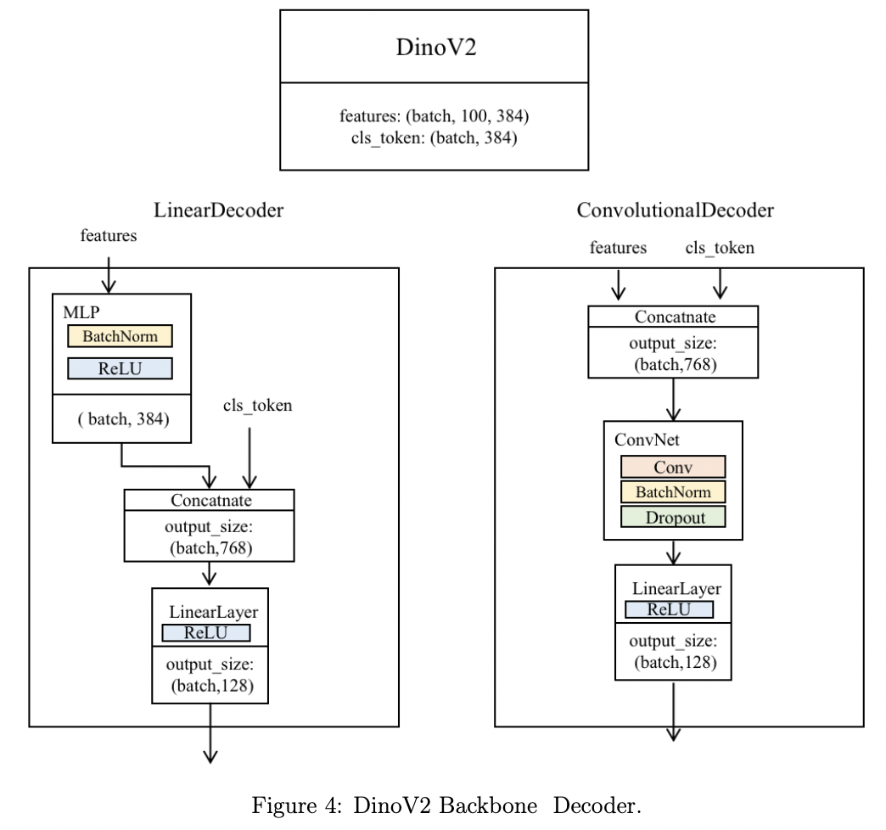
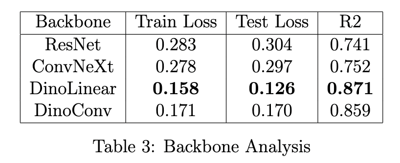
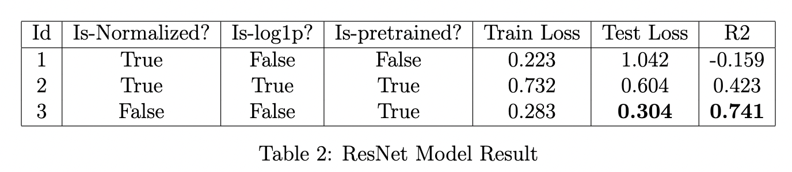

# Plant-Trait-Prediction

CS 273P: Machine Learning and Data Mining  | Winter 2024 

Yumeng Zhang, Qiyu Zhang, Zhiyan Tan

## Code

- (FINAL)main_yumeng_Dino.ipynb is the main notebook for model building, training, validation

- DataAnalysis_EDA.ipynb is the code for Data Processing, Analysis and Visualization

- Dino-Visual.py is code for image feature extraction visualization of Dino Backbone

## Model Structure
### Overall model structure

### Dino backbone and decoder structure

## Experimental Results

## Citation

[1] [https://github.com/valeoai/BF3S](https://github.com/valeoai/BF3S)

[2] [https://github.com/oscarknagg/few-shot](https://github.com/oscarknagg/few-shot)
